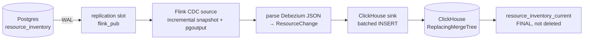

# flink-cdc-postgres-clickhouse

Change Data Capture from PostgreSQL into ClickHouse with Apache Flink: a live analytical mirror of an operational table, seconds behind the source, with no dual writes.

## The problem

A platform team's cloud resource inventory lives in Postgres, the operational source of truth: every provisioning action, every state change, written transactionally. But the questions people actually ask of it — total spend by team this week, cost trend by region, how many running instances per account — are columnar scans across a growing table. Running those against the OLTP database, next to the write traffic that keeps the platform running, is how you take production down.

CDC solves this without dual writes: instead of the application writing to two stores (and inevitably getting them out of sync), Flink reads Postgres's write-ahead log, the single record of truth, and replays it into ClickHouse. The mirror is a few seconds behind, built from the same events Postgres already produces, with no application code aware it exists.

## Architecture



## Run it

```bash
scripts/fresh_start.sh                                  # stack up, job submitted, snapshot verified
scripts/simulate_changes.py --rate 20 --seconds 120      # continuous inserts/updates/deletes
scripts/verify.sh                                        # Postgres vs. ClickHouse, exit 0 on match
```

`fresh_start.sh` runs `docker compose up -d`, waits for all services healthy, submits the Flink job, and confirms the initial 200-row snapshot matches on both sides. See below for what each piece is doing while that runs.

<details>
<summary>Individual commands, and what to look at</summary>

```bash
docker compose up -d
scripts/build.sh                                                  # builds the fat jar in a Maven container, no local Java needed
docker exec cdc-jobmanager flink run -d /opt/flink/usrlib/cdc-job.jar
docker logs -f cdc-taskmanager | grep -E "ResourceChange|CDC lag"  # typed events + end-to-end lag
scripts/slot_health.sh --watch                                     # replication slot state
```

Query ClickHouse directly:

```bash
ch() { curl -s "localhost:8123/?user=default&password=clickhouse" --data-binary "$1"; }
ch "SELECT count() FROM cdc.resource_inventory_current"
ch "SELECT * FROM cdc.resource_inventory WHERE resource_id='...'"   # every version of one row
ch "OPTIMIZE TABLE cdc.resource_inventory FINAL"                    # force merges now
```
</details>

## What you'll see

A typed event, printed by the lag logger alongside the sink:

```
ResourceChange{op=u, resourceId=res-9999, ... state=stopped, hourlyCost=0.5, lsn=26772784, isDeleted=0}
CDC lag: 576 ms (op=u, lsn=26783336, streamed=10)
```

An update landing in ClickHouse — two rows in the raw, append-only table; one in the current-state view:

```
raw:   readme-demo | running | 0.5 | _version=28028936 | _is_deleted=0
       readme-demo | stopped | 0   | _version=28036352 | _is_deleted=0
view:  readme-demo | stopped | 0
```

The [failure demo](docs/failure-demo.md) is the fuller version of this: kill the TaskManager mid-stream, watch the replication slot hold WAL while it's down, watch it drain once the job reconnects, and confirm Postgres and ClickHouse still agree afterward.

## Design decisions

- **`pgoutput`, not `decoderbufs` or `wal2json`.** Ships with stock Postgres 10+, so `postgres:16` needs no extra plugin — and it's the only decoding plugin available on RDS, Aurora and Cloud SQL, so the same job runs unchanged there.
- **`REPLICA IDENTITY FULL`**, kept deliberately. Every UPDATE/DELETE carries the full before-image, at real WAL cost, because it makes change events legible and this design's ClickHouse sink doesn't strictly need it (a delete only needs key + version + tombstone) — it's a choice made for clarity, not an accident.
- **Publication and `cdc_user` pre-created in SQL**, not left to the connector. `cdc_user` never needs `CREATE` on the database — least privilege, the production pattern.
- **Heartbeat**, a periodic write to a published table, so the replication slot advances even when the monitored table is quiet while the rest of the database writes heavily. Without it, WAL accumulates until disk fills.
- **Incremental snapshot, not lock-based.** Reads the initial 200 rows in parallel chunks with no table lock, then hands off to single-reader log streaming (there's one replication slot).
- **LSN as the version column**, not `updated_at`. Immune to clock skew, same-millisecond updates, and application code that forgets to set a timestamp.
- **Append-only sink into `ReplacingMergeTree`**, never `UPDATE`/`DELETE` against ClickHouse. ClickHouse has no cheap per-row mutation; inserting a new version is the idiomatic pattern for streaming writes.
- **Batch size and interval** (500 rows / 2 s) trade latency against part count — too-small batches create a part per insert and ClickHouse throttles or rejects with "too many parts".
- **`FINAL` in a view, not baked into every query.** Deduplicates at read time at real CPU cost; a production system with heavier query volume would prefer `argMax(...) GROUP BY` or a materialized view instead of `FINAL` on every hit.
- **`team`, `instance_size`, `hourly_cost` are `Nullable`**, mirroring Postgres exactly. AWS resources are commonly untagged (`team`), EBS volumes have no instance type, and cost can be unknown before it's priced — defaulting these to `''`/`0` would make missing data indistinguishable from real zeros and silently corrupt cost rollups.
- **DataStream API, not Flink SQL.** Chosen for explicit control over Debezium metadata (LSN, before/after images, snapshot vs. streamed) and the heartbeat filter — the SQL connector would hide exactly the mechanics this project exists to demonstrate.

## Operating this

The single most important query for this pipeline:

```sql
SELECT
  slot_name, active, active_pid,
  pg_size_pretty(pg_wal_lsn_diff(pg_current_wal_lsn(), restart_lsn))      AS retained_wal,
  pg_size_pretty(pg_wal_lsn_diff(pg_current_wal_lsn(), confirmed_flush_lsn)) AS unconfirmed,
  restart_lsn, confirmed_flush_lsn
FROM pg_replication_slots;
```
(`scripts/slot_health.sh`, `--watch` to poll every 2 s.) `active`: is a consumer attached. `retained_wal`: how much WAL Postgres cannot recycle because of this slot — the disk-risk number. `unconfirmed`: how far behind the consumer is.

**Alert on:** the slot inactive for more than a few minutes; `retained_wal` above a threshold sized against the WAL volume your Postgres instance's disk can actually absorb before it fills.

**The quiet-table failure mode.** A slot only advances when the consumer confirms an LSN, and the consumer only sees records for published tables. So a database writing heavily to *unpublished* tables, while the *published* table sits quiet, produces WAL that nothing will ever confirm past — `retained_wal` climbs even though the consumer is healthy and connected. The heartbeat (a periodic write to a published table) exists to force a confirmable record. See [docs/heartbeat-findings.md](docs/heartbeat-findings.md) — on Flink 1.20 this pipeline's heartbeat barely fired and the failure mode didn't reproduce cleanly in a 90-second test window; after upgrading to Flink 2.2.1 the heartbeat fired reliably every ~5 s. The full experiment (bounded WAL in both configurations, on a healthy active consumer) is written up there; treat the quiet-table risk as real and the heartbeat as the documented mitigation, not as something this repo has cleanly reproduced end-to-end.

**Cleanup:** dropping the Flink job does **not** drop the replication slot.
```sql
SELECT pg_drop_replication_slot('flink_slot');
```
Forgetting this leaves a slot retaining WAL forever, with no consumer ever coming back to confirm it — the disk fills silently. (`scripts/failure_demo.sh` hit this directly: a scratch capture job's slot had to be dropped by hand after use.)

**On managed Postgres:** the mechanism is identical, but decoding must be enabled ahead of time and requires a reboot. RDS/Aurora: set `rds.logical_replication=1` in the parameter group and grant `rds_replication` to the replication role. Cloud SQL: enable `cloudsql.logical_decoding`. Neither lets you install a custom decoding plugin, which is exactly why this project uses `pgoutput`.

## Guarantees

| Component | Guarantee |
|---|---|
| Flink source + checkpointed state | exactly-once |
| Sink into ClickHouse | at-least-once |
| End state in `resource_inventory_current` | effectively-once, via `ReplacingMergeTree` version dedupe |

A replayed change after a restore carries the same key and the same `_version` (its LSN), so ClickHouse collapses the duplicate. Proven under an actual TaskManager kill and a Postgres restart in [docs/failure-demo.md](docs/failure-demo.md) — 80 and 60 replayed rows respectively, `resource_inventory_current` correct both times.

## Failure demo

[docs/failure-demo.md](docs/failure-demo.md): TaskManager killed mid-stream and Postgres container restarted, both under continuous load, both recovered with `verify.sh` passing and the replication slot trace showing exactly what a slot is for.

## Not here / next steps

- **Schema evolution.** The parser reads a fixed field set; a new Postgres column is silently ignored, a dropped/renamed one it reads breaks it. Not implemented or handled.
- **Multiple tables sharing one slot.** This project uses one table and one slot; fanning out to many tables from a single publication/slot, and its throughput implications, isn't explored.
- **ClickHouse cluster and replication.** Single-node ClickHouse throughout. A `ReplicatedReplacingMergeTree` + `Distributed` setup is a different (larger) exercise.
- **Monitoring replication lag and slot size as a real dashboard.** `slot_health.sh` is a manual/scripted check, not wired into Prometheus/Grafana.
- **Backfill/reseed procedure.** No documented process for re-snapshotting a table without losing changes made during the gap, or for adding a second table to an existing pipeline.
- **`TOAST`ed column handling.** None of this project's columns are large enough to be TOASTed; the well-known Debezium gotcha (an unchanged TOASTed column can appear as a placeholder, not its value, in an UPDATE's before-image) is not exercised here.

## Version matrix that actually worked

| Component | Version |
|---|---|
| Java | 21 (`eclipse-temurin` 21.0.12, via `flink:2.2.1-java21`) |
| Apache Flink | 2.2.1 |
| Flink CDC (`flink-connector-postgres-cdc`) | 3.6.0-2.2 |
| `flink-shaded-guava` (bundled explicitly — see note) | 31.1-jre-17.0 |
| Debezium (transitive) | 1.9.8.Final |
| ClickHouse Flink connector (`flink-connector-clickhouse-2.0.0`, `all` classifier) | 0.2.0 |
| PostgreSQL | 16.15 |
| ClickHouse server | 26.8.9 |

Note: Flink CDC 3.6.0 is compiled against shaded guava 31, which Flink 1.20 shipped at runtime but Flink 2.x does not — without bundling it explicitly, the source fails with `NoClassDefFoundError: org/apache/flink/shaded/guava31/...ThreadFactoryBuilder`. Flink CDC 3.6.0 supports Flink up to 2.2.x, not 2.3. This project started on Flink 1.20.5 / Java 17 (tagged [`phase-2-flink-1.20`](../../tree/phase-2-flink-1.20)) and was upgraded after Phase 2; the original `flink-connector-jdbc` sink plan was replaced with the official ClickHouse connector once it proved to support this stack.

## Stack

- PostgreSQL 16 (`wal_level=logical`, `REPLICA IDENTITY FULL`)
- Apache Flink 2.2.1 and Flink CDC 3.6.0 (Java 21, Maven, DataStream API)
- ClickHouse 26.8 (LTS)
- Docker Compose, everything runs locally

## Repo layout

```
docker-compose.yml
postgres/init/      schema, seed data, publication, cdc_user
clickhouse/init/    ReplacingMergeTree target table, current-state view, flink_sink user
flink-job/          Maven project: CDC source → parser → ClickHouse sink
scripts/            build, simulator, verify, failure demo, slot health
docs/                failure demo results, heartbeat experiment
```
